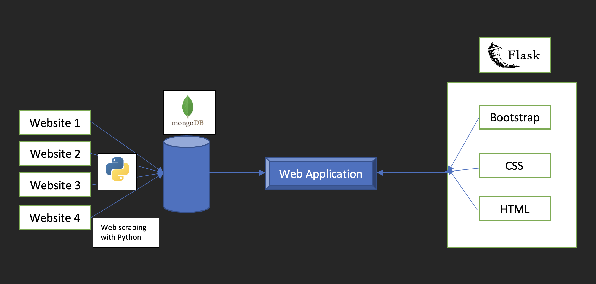
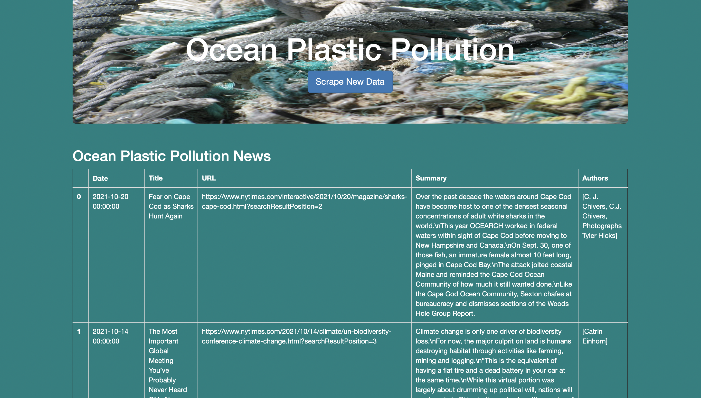

# Ocean Plastic Pollution Webscraping Project

## Overview:

In this project is to create a webpage that would scrape specific websites for recent news related to plastic pollution in oceans and display the same. The project is being done for a California Benefit Corporation that pioneers in plastic offsets and saving the oceans from plastic pollution.

## Sources of Data:

The following websites have been used as sources for scraping plastic pollution related news:

1. https://news.un.org/
2. https://oceanconservancy.org
3. https://www.nytimes.com
4. https://ellenmacarthurfoundation.org

## Purpose:

The purpose of this project is to collect and display information spread across multiple websites on a single web based application, to provide a single source of information to the end user. Instead of manually browsing through multiple websites, the information from all these spurces will be available on this web application through the click of a button. The app will automatically navigate through the sites, scrape information from them and display the same on this web application.

## Tools and Technologies:

1. Newspaper3k: Newspaper3k is the python library that is used for extracting articles from URLs.
2. Python - Programming Language used to create the script to scrape data.
3. MongoDB - a NoSQL DB has been used as a flexible option to store the many different types of data that is scraped from the websites in BSON format.
4. Flask- The web framework used to create the web application.
5. Bootstrap - Bootstrap framework and its components have been used to build a flexible, mobile responsive web application. 
6. CSS - Stylesheets have been used to design the appearance of the web application.

## Application Design:

The following diagram illustrates the architecture and working of the web application.

## Application Snapshot:

The following is an image of the developed web application.

## Project Learnings and Challenges:

1. The web page takes a little while to load and display the data after scraping.
2. It was discovered that Newspaper3K library was a better tool to scrape articles from the web rather than Beautiful Soup. (Corinne to add)
3. Certain websites (such as LinkedIn) did not return the required results due to the design of the source websites and hence were removed from the preferred datasources.

## Recommendations for Future:
1. Explore webscraping and generating results using Beautiful Soup and  Selenium.
2. Explore webscraping and generating accurate results from websites that redirect to a different page (such as LinkedIn and WWF)
3. Explore ways to scrape data from PDFs on the web.
4. Adding a News feed on the page.

